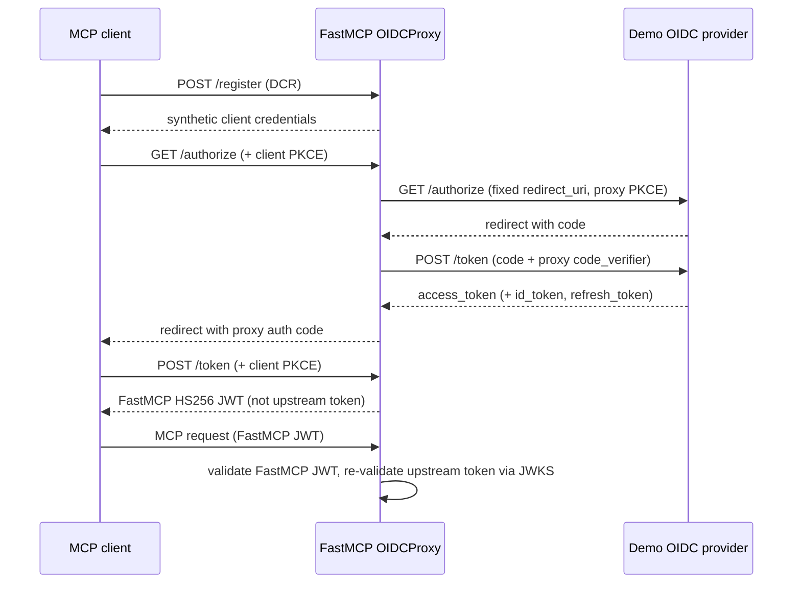

# FastMCP OIDCProxy: upstream IdP requirements for local E2E testing

Research ticket: [01-research-fastmcp-oidc-proxy-idp-requirements](../issues/01-research-fastmcp-oidc-proxy-idp-requirements.md)

**Primary sources**

| Source | URL / location |
|--------|----------------|
| FastMCP OIDC Proxy docs | https://gofastmcp.com/servers/auth/oidc-proxy |
| FastMCP OAuth Proxy docs (OIDCProxy inherits this) | https://gofastmcp.com/servers/auth/oauth-proxy |
| FastMCP source (`OIDCProxy`, `OIDCConfiguration`) | https://github.com/PrefectHQ/fastmcp/blob/main/fastmcp_slim/fastmcp/server/auth/oidc_proxy.py |
| FastMCP source (`OAuthProxy`) | https://github.com/PrefectHQ/fastmcp/blob/main/fastmcp_slim/fastmcp/server/auth/oauth_proxy/proxy.py |
| FastMCP source (`JWTVerifier`, `JWTIssuer`) | https://github.com/PrefectHQ/fastmcp/blob/main/fastmcp_slim/fastmcp/server/auth/providers/jwt.py, `jwt_issuer.py` |
| FastMCP tests (minimal valid discovery fixture) | https://github.com/PrefectHQ/fastmcp/blob/main/tests/server/auth/test_oidc_proxy.py |
| OpenID Connect Discovery 1.0 | https://openid.net/specs/openid-connect-discovery-1_0.html |
| OAuth 2.0 Authorization Server Metadata (RFC 8414) | https://datatracker.ietf.org/doc/html/rfc8414 |
| OAuth 2.0 (RFC 6749) | https://datatracker.ietf.org/doc/html/rfc6749 |
| PKCE (RFC 7636) | https://datatracker.ietf.org/doc/html/rfc7636 |
| OpenID Connect Core 1.0 (ID Token) | https://openid.net/specs/openid-connect-core-1_0.html |

---

## Executive summary

`OIDCProxy` is for **upstream providers that do not support Dynamic Client Registration (DCR)**. FastMCP discovers upstream endpoints from `/.well-known/openid-configuration`, uses **pre-registered** `client_id` / `client_secret`, and **synthesizes a full MCP-facing authorization server** (DCR, authorize, token, discovery metadata, consent UI, FastMCP-issued JWTs).

A minimal demo IdP must implement: **OIDC discovery**, **authorization** (`response_type=code`), **token** (`authorization_code` + optional `refresh_token`), and **JWKS** for JWT verification. It does **not** need DCR, MCP discovery routes, or consent UI — FastMCP provides those downstream.

---

## Architecture: what talks to what



Sources: [OAuth Proxy flow docs](https://gofastmcp.com/servers/auth/oauth-proxy#oauth-flow), [Token Architecture](https://gofastmcp.com/servers/auth/oauth-proxy#token-architecture), `OAuthProxy._build_upstream_authorize_url` and `_handle_idp_callback` in source.

---

## 1. OIDC discovery (`config_url`)

At construction, `OIDCProxy` performs a **GET** on `config_url` (typically `https://<idp>/.well-known/openid-configuration`) and parses the JSON into `OIDCConfiguration`. Default discovery timeout is **10 seconds** ([source](https://github.com/PrefectHQ/fastmcp/blob/main/fastmcp_slim/fastmcp/server/auth/oidc_proxy.py#L29-L33)).

### 1.1 Required discovery fields (`strict=True`, default)

When `strict` is not set to `False`, the following metadata fields **must be present and non-empty** ([source](https://github.com/PrefectHQ/fastmcp/blob/main/fastmcp_slim/fastmcp/server/auth/oidc_proxy.py#L117-L147)):

| Field | Used for |
|-------|----------|
| `issuer` | JWT `iss` validation (`JWTVerifier`) |
| `authorization_endpoint` | Upstream authorize redirect |
| `token_endpoint` | Code exchange and refresh |
| `jwks_uri` | JWT signature verification |
| `response_types_supported` | Advertised capability (must be present; proxy sends `response_type=code`) |
| `subject_types_supported` | OIDC metadata requirement |
| `id_token_signing_alg_values_supported` | OIDC metadata requirement |

FastMCP's own test fixture for a valid minimal discovery document ([source](https://github.com/PrefectHQ/fastmcp/blob/main/tests/server/auth/test_oidc_proxy.py#L29-L40)):

```json
{
  "issuer": "https://example.com",
  "authorization_endpoint": "https://example.com/authorize",
  "token_endpoint": "https://example.com/oauth/token",
  "jwks_uri": "https://example.com/.well-known/jwks.json",
  "response_types_supported": ["code"],
  "subject_types_supported": ["public"],
  "id_token_signing_alg_values_supported": ["RS256"]
}
```

### 1.2 Optional discovery fields (used when present)

| Field | Behavior |
|-------|----------|
| `revocation_endpoint` | Passed to `OAuthProxy` as `upstream_revocation_endpoint` ([source](https://github.com/PrefectHQ/fastmcp/blob/main/fastmcp_slim/fastmcp/server/auth/oidc_proxy.py#L391-L395)) |
| `registration_endpoint` | **Not used** — upstream DCR is explicitly out of scope for `OIDCProxy` ([docs](https://gofastmcp.com/servers/auth/oidc-proxy)) |
| `userinfo_endpoint` | Parsed into model but **not used** by default `JWTVerifier` |
| `code_challenge_methods_supported` | Informational; proxy always sends `S256` when forwarding PKCE |
| `token_endpoint_auth_methods_supported` | Informational; configure proxy via `token_endpoint_auth_method` if needed |
| `scopes_supported` | Informational for IdP; proxy advertises its own `valid_scopes` / `required_scopes` to MCP clients |

### 1.3 Relaxing validation (`strict=False`)

Setting `strict=False` on `OIDCProxy` skips mandatory-field enforcement. Construction still fails if `authorization_endpoint` or `token_endpoint` are missing after fetch ([source](https://github.com/PrefectHQ/fastmcp/blob/main/fastmcp_slim/fastmcp/server/auth/oidc_proxy.py#L384-L389)). For a demo IdP, **`strict=True` with the minimal document above is the recommended path** — it matches what FastMCP tests expect.

---

## 2. Upstream OAuth/OIDC endpoints the demo IdP must implement

### 2.1 Authorization endpoint (`authorization_endpoint`)

**Method:** `GET` (browser redirect from FastMCP)

**Query parameters FastMCP sends** ([source](https://github.com/PrefectHQ/fastmcp/blob/main/fastmcp_slim/fastmcp/server/auth/oauth_proxy/proxy.py#L880-L912)):

| Parameter | Value | Notes |
|-----------|-------|-------|
| `response_type` | `code` | Authorization code flow only |
| `client_id` | configured upstream `client_id` | Pre-registered app |
| `redirect_uri` | `{base_url}{redirect_path}` | Default `{base_url}/auth/callback` ([docs](https://gofastmcp.com/servers/auth/oidc-proxy)) |
| `state` | proxy transaction ID | Opaque to IdP; echoed back |
| `scope` | requested scopes | From MCP client / `required_scopes` / `valid_scopes` |
| `code_challenge` | S256 challenge | Present when MCP client used PKCE **and** `forward_pkce=True` (default) |
| `code_challenge_method` | `S256` | With `code_challenge` |
| `resource` | MCP resource URL | When `forward_resource=True` (default) and client sent `resource` |
| `audience` | API audience string | When `audience=` is set on `OIDCProxy` ([source](https://github.com/PrefectHQ/fastmcp/blob/main/fastmcp_slim/fastmcp/server/auth/oidc_proxy.py#L451-L453)) |
| extra params | provider-specific | Via `extra_authorize_params` |

**IdP must:**

1. Authenticate the user (login UI).
2. Validate `client_id` and that `redirect_uri` exactly matches the registered callback.
3. If `code_challenge` was sent, bind the issued code to that challenge (PKCE).
4. Redirect to `redirect_uri` with `?code=<auth_code>&state=<state>` (or error parameters per RFC 6749 §4.1.2.1).

**IdP does not need to understand MCP client loopback redirect URIs** — those are handled entirely by FastMCP ([docs](https://gofastmcp.com/servers/auth/oauth-proxy#registration-phase)).

### 2.2 Token endpoint (`token_endpoint`)

**Method:** `POST`, `Content-Type: application/x-www-form-urlencoded`, `Accept: application/json` ([source](https://github.com/PrefectHQ/fastmcp/blob/main/fastmcp_slim/fastmcp/server/auth/oauth_proxy/upstream.py#L34-L37))

#### Authorization code grant

FastMCP exchanges the IdP code server-side ([source](https://github.com/PrefectHQ/fastmcp/blob/main/fastmcp_slim/fastmcp/server/auth/oauth_proxy/proxy.py#L2716-L2755)):

| Body parameter | Required | Notes |
|----------------|----------|-------|
| `grant_type` | yes | `authorization_code` |
| `code` | yes | From IdP callback |
| `redirect_uri` | yes | Must match authorize request |
| `code_verifier` | when PKCE used | Proxy's verifier, not the MCP client's |
| `scope` | optional | Echo of requested scopes |
| extra | optional | `extra_token_params` (e.g. `audience`) |

**Client authentication** (upstream, proxy → IdP):

| `token_endpoint_auth_method` | Wire format |
|------------------------------|-------------|
| `client_secret_basic` (default) | `Authorization: Basic base64(client_id:client_secret)` ([RFC 6749 §2.3.1](https://datatracker.ietf.org/doc/html/rfc6749#section-2.3.1)) |
| `client_secret_post` | `client_id` + `client_secret` in body |
| `none` | `client_id` in body only (public client) |

([source](https://github.com/PrefectHQ/fastmcp/blob/main/fastmcp_slim/fastmcp/server/auth/oauth_proxy/upstream.py#L66-L82), [docs](https://gofastmcp.com/servers/auth/oidc-proxy))

#### Refresh token grant

When upstream returns a `refresh_token`, FastMCP may transparently refresh on each MCP request if the access token is near expiry ([source](https://github.com/PrefectHQ/fastmcp/blob/main/fastmcp_slim/fastmcp/server/auth/oauth_proxy/proxy.py#L2199-L2251)):

| Body parameter | Value |
|----------------|-------|
| `grant_type` | `refresh_token` |
| `refresh_token` | stored upstream refresh token |
| `scope` | optional, provider-dependent |

**Recommended for demo IdP:** support `refresh_token` grant and return `expires_in` on token responses.

#### Token response (JSON)

Minimum useful response for default `OIDCProxy` configuration:

```json
{
  "access_token": "<JWT or opaque string>",
  "token_type": "Bearer",
  "expires_in": 3600,
  "scope": "openid profile",
  "refresh_token": "<optional but recommended>",
  "id_token": "<JWT; required if verify_id_token=True>"
}
```

RFC 6749 §5.1 applies. If `expires_in` is omitted, FastMCP applies fallbacks (1 h with refresh token, 1 year without) ([source](https://github.com/PrefectHQ/fastmcp/blob/main/fastmcp_slim/fastmcp/server/auth/oauth_proxy/proxy.py#L1341-L1365), [docs](https://gofastmcp.com/servers/auth/oidc-proxy)).

### 2.3 JWKS endpoint (`jwks_uri`)

Must serve a [JWK Set](https://datatracker.ietf.org/doc/html/rfc7517) document at the discovered `jwks_uri`. FastMCP fetches keys by `kid` header when validating upstream JWTs ([source](https://github.com/PrefectHQ/fastmcp/blob/main/fastmcp_slim/fastmcp/server/auth/providers/jwt.py#L345-L427)).

**Not required:** `userinfo_endpoint`, token introspection, revocation — unless you supply a custom `token_verifier` that uses them ([docs](https://gofastmcp.com/servers/auth/oauth-proxy#token-verification)).

---

## 3. Client registration assumptions (upstream / demo IdP)

`OIDCProxy` exists precisely because the **upstream provider does not support DCR** ([docs](https://gofastmcp.com/servers/auth/oidc-proxy)). The demo IdP must support **static client registration**:

| Requirement | Detail | Source |
|-------------|--------|--------|
| Pre-register one OAuth client | Manual / config-file registration in the demo IdP | [OIDC Proxy docs — Provider Setup](https://gofastmcp.com/servers/auth/oidc-proxy#provider-setup-requirements) |
| `client_id` | Passed to `OIDCProxy(client_id=...)` | [source](https://github.com/PrefectHQ/fastmcp/blob/main/fastmcp_slim/fastmcp/server/auth/oidc_proxy.py#L352-L353) |
| `client_secret` | Passed to `OIDCProxy(client_secret=...)` unless using public-client mode | [source](https://github.com/PrefectHQ/fastmcp/blob/main/fastmcp_slim/fastmcp/server/auth/oidc_proxy.py#L355-L360) |
| Redirect URI | **Exactly** `{base_url}{redirect_path}` — default `http://localhost:8000/auth/callback` for local dev | [docs](https://gofastmcp.com/servers/auth/oidc-proxy#provider-setup-requirements) |
| Grant types | `authorization_code` required; `refresh_token` recommended | [source](https://github.com/PrefectHQ/fastmcp/blob/main/fastmcp_slim/fastmcp/server/auth/oauth_proxy/proxy.py#L2753-L2755) |
| PKCE | Must accept `code_challenge` / `code_challenge_method=S256` on authorize and `code_verifier` on token exchange when FastMCP forwards PKCE (default) | [docs](https://gofastmcp.com/servers/auth/oauth-proxy), [RFC 7636](https://datatracker.ietf.org/doc/html/rfc7636) |

The demo IdP **must not** require its own DCR for MCP clients. DCR at the MCP layer is entirely synthetic (see §5).

---

## 4. Scopes

### 4.1 Upstream (demo IdP)

- FastMCP forwards whatever scopes the MCP client requested (or `required_scopes` when the client omits `scope`) in the upstream authorize URL ([source](https://github.com/PrefectHQ/fastmcp/blob/main/fastmcp_slim/fastmcp/server/auth/oauth_proxy/proxy.py#L891-L893)).
- For OIDC flows that issue an `id_token`, include **`openid`** in requested scopes ([OIDC Core §3.1.2.1](https://openid.net/specs/openid-connect-core-1_0.html#AuthRequest)).
- The IdP should echo granted scopes in the token response `scope` field when they differ from the request (RFC 6749 §5.1).

### 4.2 FastMCP configuration

| Parameter | Role |
|-----------|------|
| `required_scopes` | Floor enforced on upstream JWT `scope`/`scp` claims; auto-included in authorize requests ([docs](https://gofastmcp.com/servers/auth/oidc-proxy#scope-configuration)) |
| `valid_scopes` | Superset advertised via `/.well-known` and enforced at MCP DCR ([docs](https://gofastmcp.com/servers/auth/oidc-proxy)) |
| `audience` | Sent as `audience` to authorize + token endpoints; used as JWT `aud` expectation for **access token** verification (not for `verify_id_token`) ([source](https://github.com/PrefectHQ/fastmcp/blob/main/fastmcp_slim/fastmcp/server/auth/oidc_proxy.py#L399-L411)) |

**Demo recommendation:** `required_scopes=["openid"]` (or `["openid", "profile"]`) and matching scope support in the demo IdP.

---

## 5. JWT signing, algorithms, and token verification

### 5.1 Default: verify upstream `access_token` as JWT (RS256)

Unless `token_verifier` or `verify_id_token` is configured otherwise, `OIDCProxy` builds a `JWTVerifier` from discovery metadata ([source](https://github.com/PrefectHQ/fastmcp/blob/main/fastmcp_slim/fastmcp/server/auth/oidc_proxy.py#L524-L546)):

| Setting | Default | Notes |
|---------|---------|-------|
| `jwks_uri` | from discovery | Fetched at validation time |
| `issuer` | from discovery `issuer` | `iss` claim must match |
| `algorithm` | `RS256` | Override via `algorithm=` if IdP uses ES256 etc. ([source](https://github.com/PrefectHQ/fastmcp/blob/main/fastmcp_slim/fastmcp/server/auth/providers/jwt.py#L246-L275)) |
| `audience` | `audience` param, or **unset** | When unset, `aud` is not validated ([source](https://github.com/PrefectHQ/fastmcp/blob/main/fastmcp_slim/fastmcp/server/auth/providers/jwt.py#L565-L596)) |
| `required_scopes` | from `required_scopes` param | Checked in `scope` or `scp` claim |

**Demo IdP must issue a JWT `access_token`** signed with a private key whose public half is in JWKS, containing at minimum:

- `iss` = discovery `issuer`
- `exp` = future timestamp
- `scope` or `scp` = granted scopes (if `required_scopes` configured)
- `aud` = configured `audience` (only if `OIDCProxy(audience=...)` is set)
- `sub` and/or `client_id` / `azp` (used for logging and identity; [source](https://github.com/PrefectHQ/fastmcp/blob/main/fastmcp_slim/fastmcp/server/auth/providers/jwt.py#L530-L536))

### 5.2 Alternative: opaque access tokens + `verify_id_token=True`

Many real IdPs issue opaque access tokens. FastMCP supports verifying the **`id_token`** instead ([PR #3248](https://github.com/PrefectHQ/fastmcp/pull/3248), [source](https://github.com/PrefectHQ/fastmcp/blob/main/fastmcp_slim/fastmcp/server/auth/oidc_proxy.py#L480-L496)):

- `id_token` is always a JWT per [OIDC Core §2](https://openid.net/specs/openid-connect-core-1_0.html#IDToken)
- Audience validation uses **`client_id`**, not `audience` ([source](https://github.com/PrefectHQ/fastmcp/blob/main/fastmcp_slim/fastmcp/server/auth/oidc_proxy.py#L399-L406))
- Scope enforcement moves to the FastMCP token layer (not IdP JWT scopes)
- Demo IdP **must** return `id_token` on initial code exchange when this flag is set

**Simplest demo path:** issue JWT access tokens (RS256) and leave `verify_id_token=False` (default).

### 5.3 FastMCP-issued tokens to MCP clients (downstream)

FastMCP does **not** forward upstream tokens to MCP clients. It mints its own **HS256** reference JWTs ([docs](https://gofastmcp.com/servers/auth/oauth-proxy#token-architecture), [source](https://github.com/PrefectHQ/fastmcp/blob/main/fastmcp_slim/fastmcp/server/auth/jwt_issuer.py#L79-L164)):

| Claim | Value |
|-------|-------|
| `iss` | FastMCP `issuer_url` (defaults to `base_url`) |
| `aud` | `{resource_base_url or base_url}/mcp` |
| `client_id` | MCP DCR client ID |
| `scope` | granted scopes |
| `jti` | reference to encrypted upstream token in proxy storage |
| `exp`, `iat` | aligned with upstream or `fastmcp_access_token_expiry_seconds` |

Signing key: `jwt_signing_key` if provided; otherwise HKDF-derived from `client_secret` (dev only) ([docs](https://gofastmcp.com/servers/auth/oidc-proxy)).

The demo IdP has **no role** in FastMCP JWT issuance.

---

## 6. PKCE

PKCE operates at **two layers** ([docs](https://gofastmcp.com/servers/auth/oauth-proxy#authorization-phase)):

| Layer | Who validates | Algorithm |
|-------|---------------|-----------|
| MCP client → FastMCP proxy | MCP SDK / `OAuthProxy` | Client's `code_challenge` + `code_verifier` |
| FastMCP proxy → upstream IdP | Demo IdP | Proxy's `code_challenge` + `code_verifier` when `forward_pkce=True` (default) |

Proxy PKCE details ([source](https://github.com/PrefectHQ/fastmcp/blob/main/fastmcp_slim/fastmcp/server/auth/oauth_proxy/proxy.py#L865-L878)):

- Verifier: 48-character URL-safe token
- Challenge method: **S256 only** (SHA-256 + base64url)
- Forwarding is conditional: proxy PKCE is generated only when the MCP client sent `code_challenge` ([source](https://github.com/PrefectHQ/fastmcp/blob/main/fastmcp_slim/fastmcp/server/auth/oauth_proxy/proxy.py#L1168-L1172))

**Demo IdP must:** store the `code_challenge` with the authorization code and validate `code_verifier` on token exchange per [RFC 7636](https://datatracker.ietf.org/doc/html/rfc7636).

---

## 7. Redirect URI requirements

### 7.1 Upstream (demo IdP ↔ FastMCP)

| Setting | Default | Rule |
|---------|---------|------|
| FastMCP `base_url` | e.g. `http://localhost:8000` | Public URL of MCP HTTP server |
| `redirect_path` | `/auth/callback` | Appended to `base_url` |
| Registered at IdP | `http://localhost:8000/auth/callback` | **Byte-exact match** required ([docs](https://gofastmcp.com/servers/auth/oidc-proxy)) |

### 7.2 Downstream (MCP client ↔ FastMCP)

Handled by FastMCP, not the demo IdP:

- Default: loopback redirect URIs with **varying ports** allowed ([docs](https://gofastmcp.com/servers/auth/oidc-proxy))
- Configurable via `allowed_client_redirect_uris` (wildcard patterns)
- Unsafe schemes (`javascript:`, `data:`, etc.) rejected ([docs](https://gofastmcp.com/servers/auth/oauth-proxy))

---

## 8. What the demo IdP must implement vs what FastMCP handles

### Demo IdP must implement

| Capability | Notes |
|------------|-------|
| `GET /.well-known/openid-configuration` | Minimal fields in §1.1 |
| `GET {authorization_endpoint}` | Auth code + PKCE + login UI |
| `POST {token_endpoint}` | `authorization_code` (+ `refresh_token` recommended) |
| `GET {jwks_uri}` | Public keys for JWT verification |
| Static OAuth client registry | `client_id`, `client_secret`, single redirect URI |
| User authentication | Any demo login (form, fixed user, etc.) |
| JWT access tokens (RS256) | Simplest path for default verifier |
| PKCE (S256) | Required when MCP clients use PKCE (typical) |

### FastMCP OIDCProxy handles (demo IdP does not need)

| Capability | Notes |
|------------|-------|
| MCP Dynamic Client Registration (`POST /register`) | Returns synthetic credentials; stores MCP client redirect URIs ([source](https://github.com/PrefectHQ/fastmcp/blob/main/fastmcp_slim/fastmcp/server/auth/oauth_proxy/proxy.py#L977-L1069)) |
| MCP authorization server metadata | `/.well-known/oauth-authorization-server` (RFC 8414) ([source](https://github.com/PrefectHQ/fastmcp/blob/main/fastmcp_slim/fastmcp/server/auth/oauth_proxy/proxy.py#L2501-L2550)) |
| Protected resource metadata | `/.well-known/oauth-protected-resource` (RFC 9728) via `OAuthProxy` ([source](https://github.com/PrefectHQ/fastmcp/blob/main/fastmcp_slim/fastmcp/server/auth/auth.py#L982-L986)) |
| MCP `/authorize`, `/token`, `/revoke` | Full OAuth 2.1 surface for clients |
| Consent screen | Configurable; disable for local testing: `require_authorization_consent=False` ([docs](https://gofastmcp.com/servers/auth/oidc-proxy)) |
| Callback forwarding | Fixed IdP callback → dynamic MCP client callback |
| Dual PKCE | Separate client and proxy PKCE state |
| FastMCP JWT issuance | HS256 reference tokens to MCP clients |
| Upstream token encryption + storage | Fernet-encrypted at rest ([docs](https://gofastmcp.com/servers/auth/oauth-proxy)) |
| Transparent upstream refresh | On each MCP request when near expiry |
| CIMD client support | Optional HTTPS `client_id` metadata documents ([docs](https://gofastmcp.com/servers/auth/oidc-proxy#cimd-support)) |

---

## 9. Minimal local E2E configuration checklist

Example wiring for this prototype (ports illustrative):

```python
from key_value.aio.stores.memory import MemoryStore
from fastmcp import FastMCP
from fastmcp.server.auth.oidc_proxy import OIDCProxy

auth = OIDCProxy(
    config_url="http://localhost:9000/.well-known/openid-configuration",
    client_id="mcp-proxy",                    # registered at demo IdP
    client_secret="demo-secret",              # registered at demo IdP
    base_url="http://localhost:8000",         # FastMCP HTTP server
    required_scopes=["openid"],
  # redirect_path="/auth/callback",           # default; register same at IdP
    require_authorization_consent=False,      # local testing only ([docs](https://gofastmcp.com/servers/auth/oidc-proxy))
    client_storage=MemoryStore(),             # in-memory for tests ([docs](https://gofastmcp.com/servers/auth/oidc-proxy))
)

mcp = FastMCP("demo", auth=auth)
```

**Demo IdP must register:**

- Client ID: `mcp-proxy`
- Client secret: `demo-secret`
- Redirect URI: `http://localhost:8000/auth/callback`
- Allowed grants: `authorization_code`, `refresh_token`
- PKCE: S256 supported

**Demo IdP discovery document** (serve at port 9000):

```json
{
  "issuer": "http://localhost:9000",
  "authorization_endpoint": "http://localhost:9000/authorize",
  "token_endpoint": "http://localhost:9000/token",
  "jwks_uri": "http://localhost:9000/.well-known/jwks.json",
  "response_types_supported": ["code"],
  "subject_types_supported": ["public"],
  "id_token_signing_alg_values_supported": ["RS256"]
}
```

---

## 10. Gaps and non-requirements

| Topic | Finding |
|-------|---------|
| Upstream DCR | Explicitly **not** required; use static registration |
| `userinfo_endpoint` | Not used by default verifier |
| Token introspection | Only with custom `IntrospectionTokenVerifier` |
| `registration_endpoint` in discovery | Ignored by `OIDCProxy` |
| MCP mount path | `base_url` should include any HTTP mount prefix; audience becomes `{resource_base_url or base_url}/mcp` |
| HTTPS | Not required for localhost demo; production docs recommend TLS |
| `openid` scope | Required for OIDC `id_token`; strongly recommended even when verifying access tokens |

---

## 11. Open questions for prototype implementation

1. **Access token vs id_token verification** — default JWT access tokens are simpler; confirm demo IdP library can mint RS256 access tokens (not just id_tokens).
2. **`audience` claim** — omit `OIDCProxy(audience=...)` unless the demo IdP sets `aud` on access tokens.
3. **`forward_resource`** — if demo IdP rejects unknown `resource` parameter, set `forward_resource=False` ([docs](https://gofastmcp.com/servers/auth/oauth-proxy)).
4. **Token endpoint auth method** — if demo library only supports `client_secret_post`, set `token_endpoint_auth_method="client_secret_post"`.
